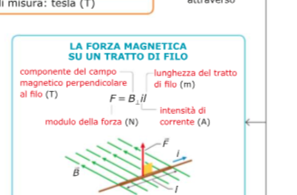
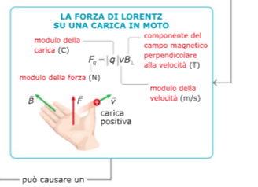
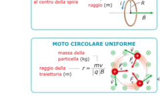

# La forza magnetica su una corrente e su una particella carica

## La forza magnetica su un filo percorso da corrente

Consideriamo un tratto di filo rettilineo di lunghezza **L**, percorso da una corrente di intensità **i**, immerso in un campo magnetico uniforme **B**.

La forza magnetica che agisce su quel tratto di filo vale:

$$F = iLB \sin\theta$$

dove **θ** è l'angolo tra la direzione del filo e quella del campo magnetico.

- Se il filo è **parallelo** al campo (θ = 0°), la forza è **zero**.
- Se il filo è **perpendicolare** al campo (θ = 90°), la forza è **massima**: F = iLB.

La **direzione** della forza è perpendicolare sia al filo sia al campo magnetico, e si determina con la **regola della mano destra**: si orientano le dita nella direzione della corrente, si piega la mano verso B, e il pollice indica la direzione della forza.

---

## La forza magnetica su una singola carica in movimento

La stessa formula si applica a una singola carica. Se una carica **q** si muove con velocità **v** in un campo magnetico **B**, la forza che subisce è:

$$F = qvB \sin\theta$$

dove **θ** è l'angolo tra la velocità della carica e il campo magnetico.

Questa forza è chiamata **forza di Lorentz**. In forma vettoriale si scrive:

$$\vec{F} = q\vec{v} \times \vec{B}$$

Anche qui, la forza è sempre **perpendicolare** alla velocità e al campo magnetico, quindi **non compie lavoro** sulla carica e **non ne cambia la velocità in modulo**, solo la direzione.

---

## Il moto di una carica in un campo magnetico uniforme

Se una carica si muove in un campo magnetico uniforme con velocità **perpendicolare** al campo, la forza di Lorentz è sempre perpendicolare alla traiettoria: questo produce un **moto circolare uniforme**.

La forza magnetica fa da forza centripeta:

$$qvB = \frac{mv^2}{r}$$

Da cui si ricava il **raggio della traiettoria circolare**:

$$r = \frac{mv}{qB}$$

Il raggio dipende dalla massa, dalla velocità e dalla carica della particella, e dall'intensità del campo.

Il **periodo** del moto circolare (il tempo per compiere un giro completo) è:

$$T = \frac{2\pi m}{qB}$$

Notare che il periodo **non dipende dalla velocità**: una particella più veloce percorre un cerchio più grande, ma in esattamente lo stesso tempo.

