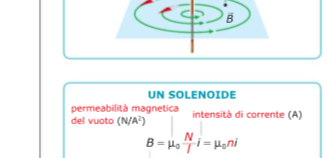

# L'elettromagnete

Avvolgendo un **solenoide** attorno a un **nucleo ferromagnetico** (cioè un blocco di materiale ferromagnetico come il ferro), si ottiene un **elettromagnete**.

Un elettromagnete si comporta come una calamita che viene attivata a comando, azionando un interruttore.

---

## Come funziona

Quando il solenoide è percorso da corrente, il nucleo ferromagnetico si magnetizza e genera un campo magnetico che si **somma** a quello del solenoide. Il campo totale risultante può essere **diverse centinaia di volte maggiore** di quello che produrrebbe il solo solenoide.

Non appena la corrente viene interrotta, il nucleo si **smagnetizza quasi completamente**: l'elettromagnete smette di comportarsi come una calamita.

---

## Applicazioni

Gli elettromagneti hanno numerose applicazioni pratiche:

- **Dischi rigidi**: le testine di scrittura contengono un piccolo elettromagnete che magnetizza localmente il disco per registrare i dati.
- **Motori elettrici**: in molti casi l'elettromagnete sostituisce il magnete permanente per generare il campo magnetico necessario al funzionamento del motore.
- **Acceleratori di particelle**: nei laboratori di fisica, potentissimi elettromagneti vengono usati per guidare i fasci di particelle cariche lungo il percorso dell'acceleratore.
